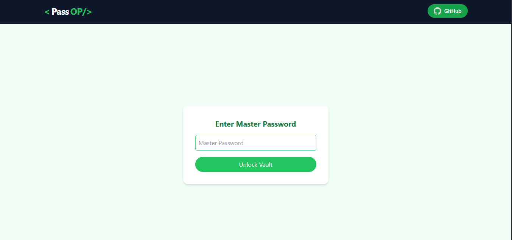
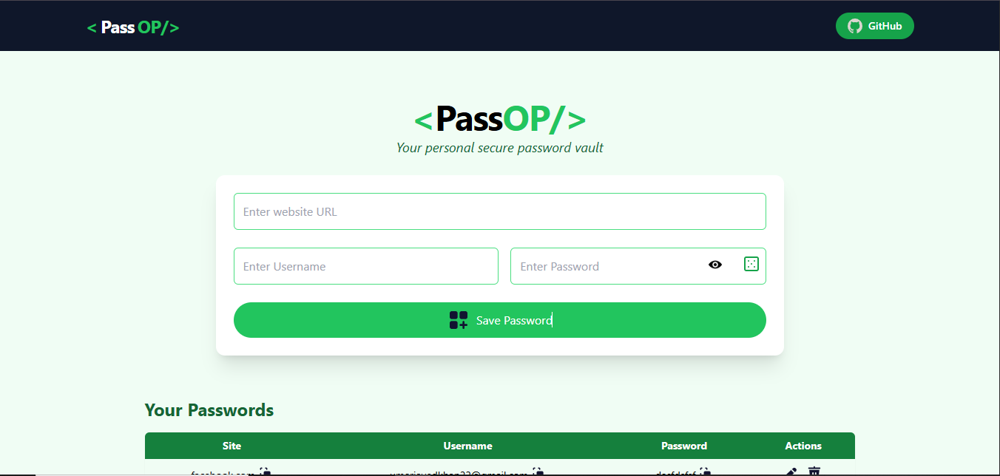

# 🔐 PassOP – Your Personal Password Manager

**PassOP** is a secure, elegant, and 100% client-side password manager built with modern web technologies. It allows users to safely store, manage, and generate strong passwords directly in the browser using AES-GCM encryption, powered by the Web Crypto API.

---

## 🌐 Live Demo

🔗 [https://passop.vercel.app](https://passop.vercel.app)  
> Try it live now — no account required!

---

## 🚀 Features

- 🔒 **Master Password Protection**  
  Your data is encrypted and accessible only with your master password.

- 📦 **Client-Side Encryption (AES-GCM)**  
  All data is stored securely in your browser with military-grade encryption.

- 🧠 **Password Strength Checker**  
  Real-time feedback on password complexity and strength.

- 🎲 **Secure Password Generator**  
  Instantly generate strong and complex passwords.

- 👁️ **Password Visibility Toggle**  
  Show/hide passwords during editing for clarity.

- 📋 **Copy to Clipboard**  
  Quickly copy usernames, passwords, or URLs with a single click.

- ✏️ **Editable Vault**  
  Edit or delete saved credentials anytime.

- 📁 **No Account Required**  
  Everything is stored locally — no sign-up, no cloud.

---

## 📸 UI Preview

> Clean, responsive, and accessible — built with Tailwind CSS

---

## 🛠️ Tech Stack

- **Frontend:** React.js, Tailwind CSS  
- **Encryption:** Web Crypto API (`AES-GCM`)  
- **Icons:** Lucide + Custom SVG  
- **Clipboard & Notifications:** React Toastify  
- **Storage:** LocalStorage (browser-based, encrypted)

---

## 🚧 Future Enhancements

Exciting ideas to take **PassOP** even further:

- 🔐 **Biometric Authentication (WebAuthn)**  
  Unlock your vault using Face ID, Touch ID, or Windows Hello.

- ☁️ **Cloud Sync with Firebase**  
  Sync encrypted data securely across devices.

- 🧠 **AI-Powered Password Suggestions**  
  Generate context-aware passwords based on website/domain.

---

## 👨‍💻 Author

Made with ❤️ by **Umer Khan**

- 🐙 GitHub: [github.com/UmarKhan-codeer](https://github.com/UmarKhan-codeer)  
- 💼 LinkedIn: [linkedin.com/in/umer-khan](https://www.linkedin.com/in/umerrjaved/)

---

## 📄 License

This project is licensed under the [MIT License](./LICENSE.md).
